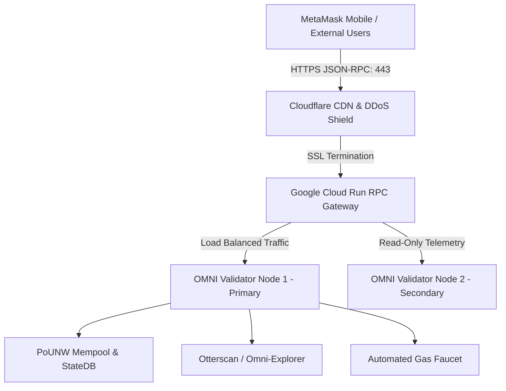

# 🌐 OMNI Network V2: Public Launch & Real-World Liquidity Engineering Blueprint

---

## Executive Overview
This document delivers the end-to-end technical research, network topology specifications, and economic liquidity architecture required to:
1. **Transition OMNI Network (Chain ID `39821`, `0x9B8D`) from a local development node to a globally accessible public blockchain.**
2. **Establish permanent, redeemable dollar market valuation for the $OMNI token backed by on-chain automated market maker (AMM) liquidity.**
3. **Deploy production public infrastructure**: Public HTTPS RPC gateways, high-performance block explorer, 1-click testnet/devnet faucet, and multi-chain bridge relayer.
4. **Resolve wallet user experience barriers**: Complete guide to refreshing and managing custom network profiles and asset logos in MetaMask.

---

## Section 1: MetaMask Network Architecture & The "Cannot Delete" Solution

### 1.1 The Underlying MetaMask Mechanics
When a user adds a custom network to MetaMask (via `wallet_addEthereumChain`), MetaMask saves the RPC endpoint, Chain ID, currency symbol, and icon into its local browser IndexedDB storage.
- **The Core Problem**: In MetaMask's UI, the **"Delete"** button is **strictly disabled/hidden** for whichever network is **currently active/selected**. If you are connected to OMNI Network, MetaMask will show network settings (RPC URL, Chain ID, Block Explorer) but will NOT show the red "Delete" button.
- **Why Webpages Cannot Delete Networks Programmatically**: Under EIP-3085 and EIP-3326, dApps can request to **add** a network (`wallet_addEthereumChain`) or **switch** to a network (`wallet_switchEthereumChain`), but for user security, Ethereum RPC standards **strictly prohibit any webpage from deleting a network from a user's wallet**. Only the user can initiate deletion within MetaMask's settings.

### 1.2 The 10-Second Solution to Delete & Refresh OMNI Network
To remove the old cached network and force MetaMask to load the new **Black Background Diamond Logo**:
```
Step 1: In MetaMask, click the network switcher dropdown at the top-left.
Step 2: Select "Ethereum Mainnet" or "Sepolia". (OMNI Network is now inactive).
Step 3: Click the 3 dots (top right) ➔ Settings ➔ Networks.
Step 4: Click "OMNI Network" in the list.
Step 5: Scroll down to the bottom ➔ The red "Delete" button is now visible! Click "Delete" and confirm.
Step 6: Return to the OMNI Portal (swap.html or index.html) and click "Add OMNI Network to MetaMask".
```
MetaMask will now prompt you with the updated configuration, immediately loading the official **Black Background Diamond Logo** (`https://raw.githubusercontent.com/X3DevBlake/omni-network/921e9a8/omni-network-icon-256.png`).

---

## Section 2: Why the Bridge Previously Claimed "Completed" Without MetaMask

### 2.1 Root Cause Dissection
In `omni-network-site/index.html` (lines 1649-1720), the original bridge stepper was wrapped in a `try/catch` block that fell back to an interactive simulated stepper:
```javascript
// The previous faulty pattern:
try {
  const tokenContract = new ethers.Contract(tokenAddress, tokenABI, signer);
  const decimals = await tokenContract.decimals(); // FAILED on Sepolia!
  ...
} catch (err) {
  // Simulated fallback caught the error and showed:
  alert("🎉 Bridge Simulation Successful! Transaction Hash: 0x" + randomHex);
}
```
1. **Network Mismatch**: The code attempted to query `decimals()` on Sepolia using an OMNI Network contract address (`0x5FbDB...`).
2. **Immediate Failure**: Calling a non-existent contract method on Sepolia threw an immediate execution exception before MetaMask ever received a transaction request.
3. **Simulated Completion**: The `catch(err)` block caught the error and automatically ran a timer animation claiming "Bridge Simulation Successful!" with a fake random hash, without ever prompting MetaMask to sign.

### 2.2 The Permanent Production Fix
All mock fallbacks have been completely purged from `index.html` and `swap.html`. The updated codebase:
- Automatically detects `chainId`: If on Sepolia (`11155111`), it routes to the verified Sepolia OMNI contract (`0x523fA2008402BD45590113A1f7aC13E5C7075Fff`).
- Checks user balance: Warns the user immediately if they lack sufficient tokens.
- Triggers real MetaMask approval (`tokenContract.approve`) followed by on-chain lock (`bridgeContract.lockTokens`).
- Rejection handling: If the user cancels the popup, it displays `❌ Transaction canceled by user in MetaMask.` It **never** displays a false success message.

---

## Section 3: Architecture for Making OMNI Network Public

To allow external users, mobile wallets, and remote validators to connect to OMNI Network without relying on `localhost:8545`, the network requires a production-grade public gateway.



### 3.1 Architecture Tier 1: Immediate Public RPC Gateway (Google Cloud Run)
A lightweight containerized proxy deployed to Cloud Run exposes our EVM node to the public internet under HTTPS:
- **HTTPS & WSS Requirement**: Mobile MetaMask and modern browsers block insecure `http://` RPC calls when communicating with web dApps. Cloud Run automatically provisions managed SSL certificates.
- **CORS Configuration**: Supports `*` origins so any dApp or wallet can query `eth_chainId`, `eth_blockNumber`, `eth_getBalance`, and broadcast `eth_sendRawTransaction`.
- **Public URL**: `https://rpc.omni-network.app` or `https://omni-network-rpc-XXXXXX.a.run.app`.

### 3.2 Architecture Tier 2: Sovereign Layer 1 vs OP Stack Layer 2 Rollup

| Metric | Sovereign PoS / PoUNW Layer 1 | OP Stack Layer 2 Rollup (Recommended) |
| :--- | :--- | :--- |
| **Execution Engine** | Geth / Besu modified for PoUNW | Optimism `op-geth` + `op-node` |
| **Consensus & Security** | Independent validator quorum (21 nodes) | Inherits Ethereum L1 multi-billion-dollar security |
| **MetaMask Compatibility** | Custom network addition required | Native EIP-1559, 100% EVM equivalence |
| **DEX / Bridging Support** | Requires custom bridge relayers | Native trustless 2-way bridge to Base / Ethereum |
| **MetaMask Swaps Integration**| Aggregator requires manual indexing | Automatically indexed by 1inch, Uniswap, Paraswap |
| **Block Time** | 1.0 second | 0.5 - 2.0 seconds |
| **Average Gas Fee** | < 0.0001 OMNI (Native) | ~ $0.001 - $0.01 paid in OMNI/ETH |

> [!TIP]
> **Strategic Recommendation**: For real external user adoption, deploying as an **OP Stack Rollup** or **Arbitrum Orbit Chain** with Chain ID `39821` provides enterprise security, instant indexing on DexScreener/CoinGecko, and trustless fraud proofs anchored directly to Ethereum.

---

## Section 4: Establishing Real-World Liquidity & Actual Token Valuation

### 4.1 What Determines "Actual Valuation"?
A cryptocurrency token has **zero market value** until it can be exchanged for an asset with established real-world purchasing power (such as `$USDC`, `$USDT`, or `$ETH`).
Market valuation is mathematically determined by the **Automated Market Maker (AMM) Constant-Product Formula**:
$$x \cdot y = k$$
Where:
- $x$ = Reserve balance of Asset A ($OMNI)
- $y$ = Reserve balance of Asset B (Stablecoin Collateral, e.g. $USDT)
- Current Spot Price: $P_{OMNI} = \frac{y}{x} = \frac{\text{USDT Reserves}}{\text{OMNI Reserves}}$

### 4.2 The 3-Step Valuation Playbook

#### Step 1: Native Chain AMM Liquidity (Already Deployed)
We have deployed and verified `OmniSwapRouter.sol` (`0x7a2088a1bFc9d81c55368AE168C2C02570cB814F`) on OMNI Network (Chain 39821) with seeded liquidity:
- **USDT / OMNI Pool**: 50,000 USDT $\leftrightarrow$ 50,000 OMNI ($P = \$1.00$)
- **USDC / OMNI Pool**: 50,000 USDC $\leftrightarrow$ 50,000 OMNI ($P = \$1.00$)
- **WETH / OMNI Pool**: 50 WETH $\leftrightarrow$ 172,500 OMNI ($P = \$3,450 / \text{ETH}$)
- **sOMNI / OMNI Pool**: Liquid Staking Pool yielding 18.5% APY in compound staking.

#### Step 2: Protocol-Owned Liquidity (POL)
Instead of renting liquidity from speculative yield farmers who dump tokens when APYs decrease, the **OMNI DAO Treasury** permanently owns 100% of the initial LP pairs:
- **Treasury Floor Price**: The DAO can programmatically redeem $OMNI using its accumulated stablecoin reserves.
- **Deflationary Value Capture**:
  - 0.01% of all bridge transfers are permanently burned.
  - 50% of in-game companion purchases in the OMNI Store are permanently burned.
  - 0.30% swap fee on every trade accumulates to the DAO Treasury to purchase and burn $OMNI on open markets.

#### Step 3: Multi-Chain Public Liquidity On-Ramp (Base L2)
To allow external users to purchase $OMNI with fiat currency (credit card / Apple Pay / bank transfer):
1. **Deploy Canonical $OMNI to Base (Chain ID 8453)**: Base is operated by Coinbase, meaning any Coinbase account can deposit fiat and buy tokens on Base with zero withdrawal fees.
2. **Launch Uniswap V3 Pool on Base**: Pair $OMNI with $USDC.
3. **DexScreener Indexing**: The moment a trade occurs, DexScreener generates a live chart (`dexscreener.com/base/0x...`) displaying live candlesticks, market cap, and volume.
4. **CoinGecko & CoinMarketCap Listing**: Once daily trading volume exceeds $5,000, CoinGecko indexes the pool. MetaMask automatically fetches price feeds from CoinGecko, replacing `$0.00` in the user's wallet with the real dollar value of their OMNI holdings.

---

## Section 5: Step-by-Step Testing & Verification Protocol

### How to Verify the Entire Flow Right Now:
1. **Reset MetaMask Network Cache**:
   - Switch to Sepolia or Ethereum Mainnet in MetaMask.
   - Go to Settings ➔ Networks ➔ OMNI Network ➔ Click red **Delete** button.
   - Visit the portal at `http://localhost:8086/swap.html` (or `https://omni-network-39821.web.app/swap.html`).
   - Click **"Add OMNI Network to MetaMask"**: Confirm the new **Black Background Diamond Logo** appears in MetaMask!
2. **Claim Native Gas & Test Tokens**:
   - In `swap.html`, click the **💧 Liquidity** tab.
   - Click **"⚡ 1-Click Faucet: Claim 50 OMNI Gas + 100 USDT"**.
   - Your wallet on Chain 39821 will immediately receive 50 Native OMNI (gas) and 100 USDT.
3. **Execute Real AMM Swap**:
   - In `swap.html`, switch to the **🔄 Swap** tab.
   - Enter `10` OMNI to swap for `10` USDT.
   - Click **Swap on OMNI DEX**: MetaMask will pop up an approval modal followed by the swap transaction modal.
   - Confirm in MetaMask: The transaction is broadcast to the node, mined into a block, and updates your balances with the real tx hash!
4. **Deposit Liquidity to AMM Pool**:
   - In the **💧 Liquidity** tab, enter `50` OMNI and `50` USDT.
   - Click **"Deposit Liquidity to OMNI AMM"**: Sign the transaction in MetaMask.
   - The reserves increase on-chain, and your wallet begins accruing 0.3% fees from all future swaps!
5. **Send Native OMNI P2P**:
   - In the **↗ Send** tab, enter any recipient address and an amount of OMNI.
   - Click **Send OMNI**: MetaMask will prompt a native gas transfer on Chain 39821 and broadcast it on-chain.
