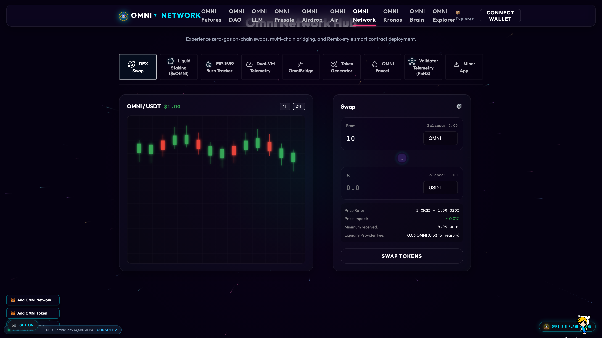

# Omni Network

> Layer 1 High-Throughput Blockchain & Web Miner V3

  

---

## 📸 Visual Showcase

<div align="center">
  
</div>

<div align="center">
  <br />
  <a href="https://omni-network-39821.web.app" target="_blank">
    
  </a>
  <a href="https://omni-network-39821.web.app" target="_blank">
    
  </a>
</div>

---

## 🌟 Overview

Omni Network is the official Layer 1 blockchain portal for the Omni ecosystem. It features the innovative Proof-of-Useful-Neural-Work (PoUNW) consensus mechanism and an in-browser WebGL particle miner (Miner V3) allowing users to contribute neural compute directly from their browser while earning block rewards.

### 🛠️ Technology Stack
`WebGL` • `Three.js` • `JavaScript` • `HTML5/CSS3` • `PoUNW Consensus` • `Firebase Hosting`

---

## 🚀 Key Features

- ✨ **Proof-of-Useful-Neural-Work (PoUNW) Consensus Architecture**
- ✨ **In-Browser WebGL Particle Miner V3 with 250k node particle matrix**
- ✨ **Real-time Neural Hashrate & Difficulty Telemetry**
- ✨ **Validator Node Topology & Block Verification Explorer**
- ✨ **Native EVM Compatibility & Smart Contract Deployment Portal**

---

## 📁 Repository Structure

```
.
├── screenshots/
│   └── showcase_preview.png    # High-definition showcase preview
├── index.html                  # Main application entrypoint
├── style.css                   # Liquid Glass design system & styling
└── README.md                   # Project documentation
```

---

## 💻 Getting Started

### Prerequisites
- Modern Web Browser (Google Chrome, Brave, Safari, Edge) with WebGL enabled.
- Python 3 or Node.js for local hosting.

### Local Development
```bash
# Clone the repository
git clone https://github.com/X3DevBlake/omni-network.git
cd omni-network

# Option 1: Serve locally via Python
python3 -m http.server 8080

# Option 2: Serve via Node.js / npx
npx serve .
```

Visit `http://localhost:8080` in your browser.

---

## 🌐 Omni Ecosystem Directory

| Application | Description | Live Link |
| :--- | :--- | :--- |
| **Omni Futures** | 200x Perps & Spot Synthetics Exchange | [Launch](https://omni-futures-39821.web.app) |
| **Omni DAO** | Governance, Staking & Yield Protocol | [Launch](https://omni-dao-39821.web.app) |
| **Omni Network** | L1 Blockchain Portal & Web Miner V3 | [Launch](https://omni-network-39821.web.app) |
| **Omni Explorer** | Real-Time Block & Telemetry Explorer | [Launch](https://omni-explorer-39821.web.app) |
| **Omni LLM** | Autonomous AI Assistant & Season Pass | [Launch](https://omni-llm-39821.web.app) |
| **Omni Brain** | Distributed Neural Supercomputer | [Launch](https://omni-brain-39821.web.app) |
| **Omni Kronos** | Autonomous 3D Game Engine & ADE | [Launch](https://omni-kronos-39821.web.app) |
| **OmniAir** | Social Streaming & Creator Economy | [Launch](https://omniair-39821.web.app) |
| **Omni Presale** | Multichain Presale On-Ramp Portal | [Launch](https://omni-presale-39821.web.app) |
| **Omni Airdrop** | Ecosystem Rewards & Sybil Verifier | [Launch](https://omni-airdrop-39821.web.app) |
| **OmniPresences** | 3D Digital Earth Geospatial Presence | [Launch](https://omni-presences-39821.web.app) |
| **Omniclaw** | Autonomous Web Agent & Assistant Desk | [GitHub](https://github.com/X3DevBlake/Omniclaw) |

---

## 📄 License
Released under the [MIT License](LICENSE). Copyright © 2026 Omni Network.
